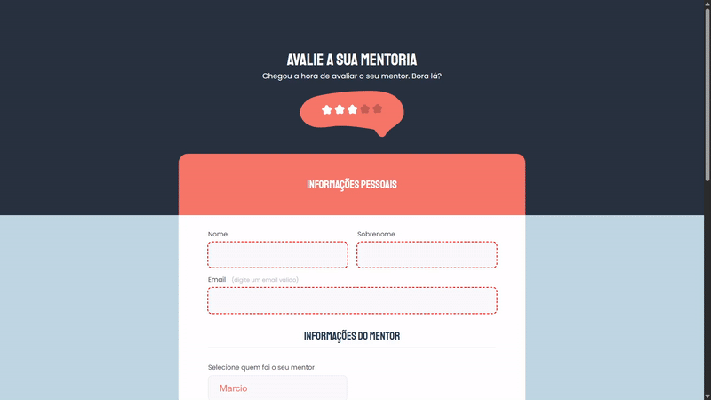

# Desafio - Avaliação Mentoria

> Este é um formulário HTML simples faz parte de um desafio promovido pela Rocketseat durante a formação Explore para a avaliação de mentoria. Ele permite que os usuários avaliem a experiência de mentoria e agendem a próxima sessão. O formulário é dividido em seções que coletam informações pessoais do usuário, detalhes sobre o mentor, feedback sobre a mentoria e a programação da próxima sessão.

## Funcionalidades

- Imagem centralizada no header
- Input's customizados
- Checkbox persolizado
- Botão customizado
- Formulário com data e hora
- Validações simples

## Stack utilizada

**Front-end:** HTML, CSS

